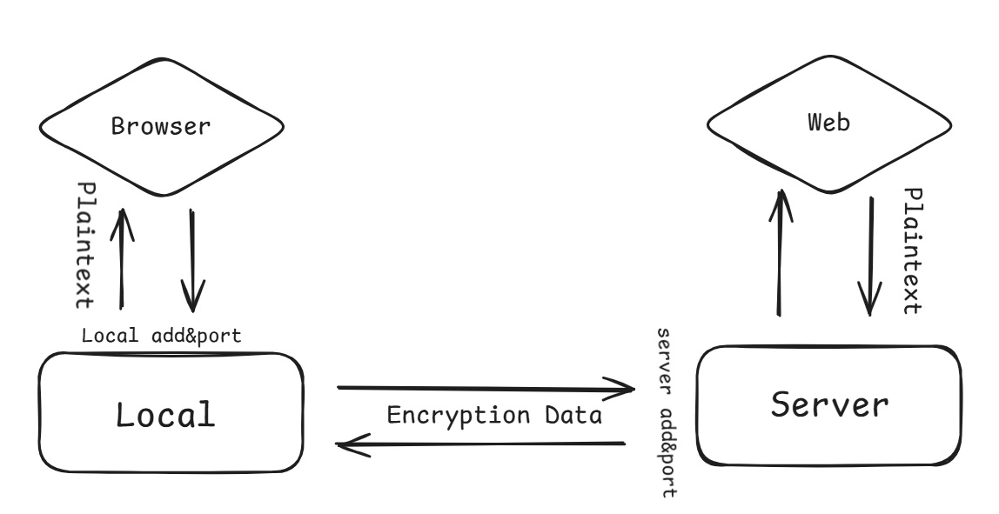
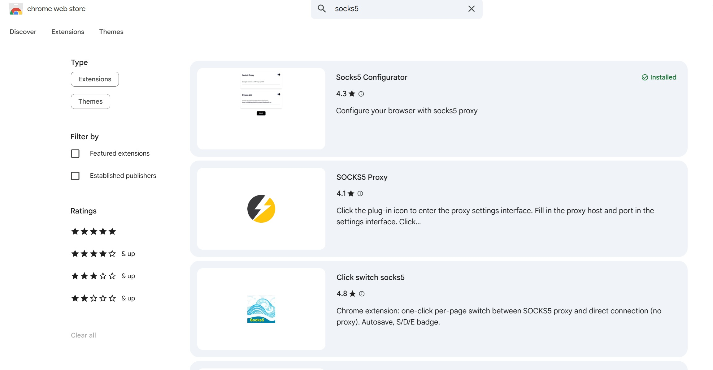

# Encrypted-Socks5-proxy

Adapted from socks5 protocol in sake of enhance security and anonymity. Refer from shadowsocks structure but more easier and intelligible. This is the super easy version of python. The code just for study purpose. 
<br>
<br>

#### DISCLAMER
`The authors of this repository disclaim any and all responsibility
for the misuse of the information,tools or techniques described herein.
The content is provided solely for educational and research purposes.
Users are strictly advised to utilize this information in accordance with
applicable laws and regulations and only on systems for which they have
explicit authorization.`

<br>

# Introduction

<br>

There are two simple source file "local.py" and "server.py". <br>
The local.py should run on your PC to collect the network traffic with socks5 protocol.<br>
And the server.py should run on your remote server to catch the local request and relay it to target website.<br>
The encryption happened between the local to server,you can choose ChaCha20Poly1305,AESGCM or XOR. 
<br>
<br>

### The configuration file parameter:

```
local_ip: "local.py" listen address,should be "127.0.0.1"
local_port: "local.py" listen port,"0-65535"
server_ip: "server.py" listen address,you should fill the public IPV4
server_port: "server.py" listen port,"0-65535"
password: use to encrypt the network data and authorizaion.
buffer: the maximum bytes of one analysis
encrypt_num: 0 -no encryption, 1 -Ploy1305, 2 -AESGCM, 3 -XOR  (0 and 3 not safe)
monitor_flow: true -monitor the data content, false -just show the length of it
```
<br>

# Usage

<br>

### -->Window(PowerShell) 


#### step 1.clone the project and enter the directory:
```bash
git clone https://github.com/peterrayn/Encrypted-Socks5-proxy.git
cd Encrypted-Socks5-proxy
```
<br>

#### step 2.

```bash
change the configuration file (src\configuration.json)
refer above content "The configuration file parameter"
```
<br>

#### step 3.run in a new environment(optional):
 ```bash
python -m venv env
./env/Scripts/Activate.ps1
```
<br>

#### step 4.install the dependance:
```bash
pip install cryptography
```
<br>

#### step 5.run local file:
 ```bash
python src/local.py
```
<br>

#### OR run server file:
 ```bash
python src/server.py
```

<br>

### -->MAC or Linux
#### step 1.
```bash
git clone https://github.com/peterrayn/Encrypted-Socks5-proxy.git
cd Encrypted-Socks5-proxy
```
<br>

#### step 2.configure it
```bash
vim src/configuration.json
```
<br>

#### step 3.
```
python3 -m venv env
source env/bin/activate
pip install cryptography
```
<br>

#### step 4.run local file:
 ```bash
python3 src/local.py
```
#### OR run server file:
 ```bash
python3 src/server.py
```
<br>

#### You can use browser extensions or v2rayN on your PC to send the network data.

### -->Browser Extension


#### fill the local address to the browser extension.
<br>

### -->Proxy tool
#### when you run the local.py, there will appear a message like this:

```bash
(Additional) V2rayN link-->
socks://Og@127.0.0.1:9999#minisocks
```
#### you can copy it and use v2rayN to run it
<br>

## If you find this project useful, please consider giving it a ⭐. Thanks!🙏💖
<br>
<br>
<br>

## :P

<br>
<br>
<br>
<br>

